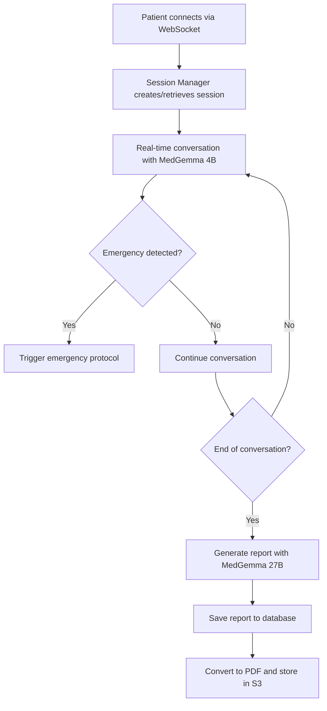

# 🩺 WhatsUpDoc - Intelligent Pre-diagnosis Platform Backend

<div align="center">


**🏆 Built for the [Google Healthcare Hackathon](https://gdg.community.dev/events/details/google-gdg-paris-presents-solve-for-healthcare-amp-life-sciences-with-gemma-hackathon-1/) by EPITA Students**

_An automated pre-diagnosis tool and patient scheduling prioritization system powered by [MedGemma](https://deepmind.google/models/gemma/medgemma/) AI_

</div>

**Emma** is an intelligent cardiovascular triage system powered by Google's MedGemma AI models, designed to provide empathetic patient care through conversational AI interfaces.

## 🎯 System Overview

Emma serves as a digital cardiologist assistant that conducts patient conversations, performs medical triage, and generates clinical reports. The system integrates multiple AI models, real-time communication, and persistent storage to deliver comprehensive healthcare support.

### Core Capabilities

- **🤖 Conversational AI**: Real-time patient interactions using MedGemma 4B/27B models
- **🏥 Medical Triage**: Automated cardiovascular risk assessment and patient classification
- **📋 Clinical Documentation**: Auto-generation of structured medical reports
- **🚨 Emergency Detection**: Intelligent recognition of critical symptoms requiring immediate attention
- **📁 Document Management**: Secure file upload and processing with Google Cloud Storage
- **👥 Patient Management**: Complete patient data lifecycle with MySQL persistence

## 🏗️ Architecture & Tech Stack

### Backend Infrastructure


### Technology Components

| Component          | Technology                | Purpose                                              |
| ------------------ | ------------------------- | ---------------------------------------------------- |
| **Web Server**     | FastAPI + Uvicorn         | REST API and WebSocket endpoints                     |
| **AI Models**      | Google Vertex AI MedGemma | Medical conversation and report generation           |
| **Session Store**  | Redis                     | Real-time message persistence and session management |
| **Database**       | MySQL (Google Cloud SQL)  | Patient records and medical reports                  |
| **File Storage**   | Google Cloud Storage      | Document uploads and PDF reports                     |
| **PDF Generation** | markdown-pdf              | Convert medical reports to PDF format                |

## 🤖 AI Model Architecture

### MedGemma 4B - Conversational Interface

- **Model Type**: `google_medgemma-4b-it-mg-one-click-deploy`
- **Specialization**: Real-time patient conversations and cardiovascular triage
- **Key Features**:
  - 89.8% accuracy on MedQA benchmark
  - 66.4% accuracy in cardiovascular disease detection
  - Multimodal support (text + image processing)
  - EPOF (French clinical protocol) assessment
  - Emergency detection with `<<EMERGENCY>>` and `<<END_OF_CONVERSATION>>` tokens

### MedGemma 27B - Report Generation

- **Model Type**: `google_medgemma-27b-text-it-mg-one-click-deploy`
- **Specialization**: Clinical documentation and structured report generation
- **Output Format**: Structured JSON with health status classification
- **Capabilities**:
  - EHR-compatible documentation
  - Risk stratification (normal/follow-up/critical)
  - Clinical reasoning and differential diagnosis
  - Compliance with medical documentation standards

## 🔄 System Workflow

### 1. Patient Interaction Flow



### 2. Data Processing Pipeline

1. **Input**: Patient messages via WebSocket
2. **Session Management**: Redis stores conversation history
3. **AI Processing**: MedGemma models analyze and respond
4. **Triage Classification**: Automatic health status determination
5. **Report Generation**: Structured clinical documentation
6. **Storage**: MySQL for structured data, GCS for documents

### 3. Emergency Escalation Protocol

- **Detection**: AI models identify critical symptoms
- **Triggers**: `<<EMERGENCY>>` token in AI response
- **Actions**: Immediate escalation with reference R69-073
- **Documentation**: Automatic critical status classification

## 📊 Database Schema

### Patients Table

```sql
CREATE TABLE patients (
    id VARCHAR(50) PRIMARY KEY,
    name VARCHAR(255) NOT NULL,
    age INT NOT NULL,
    gender VARCHAR(20),
    created_at TIMESTAMP DEFAULT CURRENT_TIMESTAMP
);
```

### Reports Table

```sql
CREATE TABLE reports (
    id VARCHAR(50) PRIMARY KEY,
    patient_id VARCHAR(50) NOT NULL,
    summary TEXT,
    health_status VARCHAR(50) NOT NULL, -- 'normal', 'follow-up', 'critical'
    report_date DATE NOT NULL,
    report_url TEXT,
    created_at TIMESTAMP DEFAULT CURRENT_TIMESTAMP,
    FOREIGN KEY (patient_id) REFERENCES patients (id)
);
```

## 🚀 API Endpoints

### WebSocket Communication

- **Endpoint**: `/ws`
- **Headers**: `user-id`, `session-id`
- **Purpose**: Real-time patient conversations

### REST API Endpoints

| Method | Endpoint                         | Description                           |
| ------ | -------------------------------- | ------------------------------------- |
| `GET`  | `/health`                        | System health check                   |
| `GET`  | `/`                              | Service status                        |
| `POST` | `/upload`                        | File upload to Google Cloud Storage   |
| `GET`  | `/patients`                      | List all patients with latest reports |
| `GET`  | `/patients/{patient_id}`         | Get specific patient details          |
| `GET`  | `/patients/{patient_id}/reports` | Get patient's report timeline         |
| `GET`  | `/reports/{report_id}`           | Get specific report details           |

### Sample WebSocket Message

```json
{
  "type": "text",
  "content": "I've been experiencing chest pain during exercise"
}
```

### Sample API Response

```json
{
  "patient_id": "p001",
  "name": "Alice Smith",
  "age": 29,
  "gender": "Female",
  "report_id": "r101",
  "health_status": "follow-up",
  "report_date": "2024-06-01",
  "summary": "Exercise-induced chest pain, cardiology evaluation recommended"
}
```

## ⚙️ Configuration & Setup

### Environment Variables

```bash
# Vertex AI Configuration
VERTEX_PROJECT_ID=your-gcp-project-id
VERTEX_REGION=europe-west4
MODELS_CONFIG_PATH=models.json

# Database Configuration
DB_HOST=your-mysql-host
DB_PORT=3306
DB_NAME=patients
DB_USER=your-db-user
DB_PASSWORD=your-db-password

# Redis Configuration
REDIS_HOST=localhost
REDIS_PORT=6379
REDIS_DB=0
REDIS_PASSWORD=your-redis-password
```

### Quick Start

```bash
# Install dependencies
pip install -r requirements.txt

# Set up environment variables
cp .env.example .env
# Edit .env with your configuration

# Initialize database
python -c "from utils.db_client import DBClient; DBClient()"

# Start the server
uvicorn main:app --host 0.0.0.0 --port 8000 --reload
```

### Docker Deployment

```bash
# Build container
docker build -t emma-backend .

# Run with environment file
docker run --env-file .env -p 8000:8000 emma-backend
```

## 🔧 Core Components

### `/utils/ai_client.py`

- **Purpose**: Vertex AI integration and model management
- **Features**: OpenAI-compatible interface, automatic token refresh, multi-model support
- **Models**: Handles both MedGemma 4B (conversation) and 27B (reports)

### `/utils/db_client.py`

- **Purpose**: MySQL database operations
- **Features**: Patient CRUD, report management, health checks
- **Tables**: Patients, reports with foreign key relationships

### `/utils/redis_client.py`

- **Purpose**: Session and message persistence
- **Features**: Conversation history, session management, real-time messaging
- **Data Format**: JSON messages with timestamps and metadata

### `/utils/file_handler.py`

- **Purpose**: File upload and storage management
- **Features**: Google Cloud Storage integration, thumbnail generation, type validation
- **Supported**: Images, documents, audio, video files

### `/utils/md_to_pdf.py`

- **Purpose**: Report generation and PDF conversion
- **Features**: Markdown to PDF, custom styling, metadata support
- **Output**: Professional medical reports in PDF format

## 🏥 Medical AI Features

### EPOF Assessment (French Clinical Protocol)

- **E (Essoufflement)**: Dyspnea and breathing difficulties
- **P (Prise de poids)**: Rapid weight gain indicators
- **O (Œdèmes)**: Edema and swelling detection
- **F (Fatigue)**: Weakness and exercise intolerance

### Triage Classification

| Status        | Criteria                                 | Action                      |
| ------------- | ---------------------------------------- | --------------------------- |
| **Normal**    | Routine symptoms, stable condition       | Standard appointment        |
| **Follow-up** | Concerning symptoms requiring monitoring | Priority scheduling         |
| **Critical**  | Emergency indicators, severe symptoms    | Immediate medical attention |

### Emergency Detection

- Chest pain >10 minutes with risk factors
- Severe dyspnea or orthopnea
- EPOF criteria present
- Patient distress indicators
- Clinical uncertainty requiring escalation

## 📈 Monitoring & Health Checks

### System Health Endpoints

- **Application**: `/health` - Service availability and dependencies
- **Database**: Connection status and query performance
- **Redis**: Cache connectivity and session store health
- **AI Models**: Vertex AI endpoint availability and response times

### Logging & Debugging

- **Level**: INFO for operations, ERROR for failures
- **Format**: Structured logging with timestamps and context
- **Output**: Console (stdout) for containerized deployment

## 📝 Development Guidelines

### Code Structure

```
├── main.py              # FastAPI application and WebSocket handlers
├── config.py            # Environment configuration and settings
├── models.json          # AI model configurations and prompts
├── requirements.txt     # Python dependencies
└── utils/
    ├── ai_client.py     # Vertex AI client and model management
    ├── db_client.py     # MySQL database operations
    ├── redis_client.py  # Session and message persistence
    ├── file_handler.py  # File upload and storage
    ├── md_to_pdf.py     # Report generation and PDF conversion
    ├── context_builder.py # Conversation formatting for AI
    └── custom_types.py  # Type definitions and data structures
```

### Testing

```bash
# Run health checks
curl http://localhost:8000/health

# Validate AI model responses
python ai_client_debug.py
```

## 📄 License

This project is licensed under the MIT License - see the [LICENSE](LICENSE) file for details.

---

**Built by the WhatsUpDoc Team with ❤️ for better healthcare outcomes**
